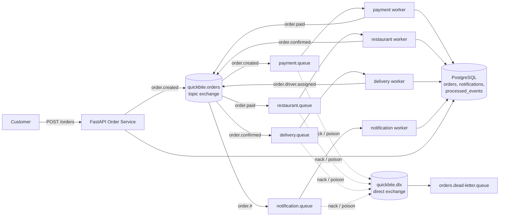

# Architecture

## System overview



Order lifecycle: `PENDING → PAID → CONFIRMED → DRIVER_ASSIGNED`, with `FAILED` as the terminal state when payment exhausts its retries.

## RabbitMQ topology

All exchanges, queues, and messages are **durable/persistent**; the API publishes with **publisher confirms**.

| Queue | Binding | Consumer |
|---|---|---|
| `payment.queue` | `order.created` | payment worker |
| `restaurant.queue` | `order.paid` | restaurant worker |
| `delivery.queue` | `order.confirmed` | delivery worker |
| `notification.queue` | `order.#` | notification worker |
| `<queue>.retry` (×4) | — (published directly via the default exchange) | nobody; TTL expiry dead-letters back to `quickbite.orders` |
| `orders.dead-letter.queue` | via `quickbite.dlx` | nobody (manual review) |

### Routing keys

`order.created`, `order.paid`, `order.payment.failed`, `order.confirmed`, `order.driver.assigned`, `order.failed` — as specified in the assignment.

### Why `order.#` and not `order.*` for notifications

The assignment suggests `order.*` so the notification queue "receives all order events". But in AMQP topic matching, `*` matches **exactly one word**: `order.*` matches `order.created` / `order.paid` / `order.confirmed`, but **not** the three-word keys `order.driver.assigned` and `order.payment.failed`. With `order.*` the "Driver has been assigned" notification would silently never be sent — verified by test. `order.#` (`#` matches zero or more words) implements the stated intent.

### Retry queues (delayed retries without blocking)

Each worker queue has a companion `<queue>.retry` queue configured with `x-dead-letter-exchange = quickbite.orders` and a fixed `x-dead-letter-routing-key` that routes back to the original queue. On transient failure the worker publishes the message to its retry queue **with a per-message TTL** (exponential backoff: 5s → 10s → 20s) and acks the original. When the TTL expires, the broker dead-letters the message back to the topic exchange, where it is redelivered. Workers are never blocked waiting; at most one timer per failed message lives in the broker.

## Reliability protocol (per message)

Implemented once in `workers/base.py`, inherited by all four workers:

```
1. Parse + validate JSON. Poison (bad JSON/schema) → nack → DLQ. Never retried.
2. Idempotency guard: INSERT (idempotency_key, worker) into processed_events
   in the SAME transaction as the work.
   - Conflict → duplicate delivery: republish the row's stored outgoing events,
     ack. The work is never re-run.
3. process() does the business logic and RETURNS outgoing (routing_key, payload)
   events instead of publishing them.
4. Store the outgoing events on the guard row. COMMIT.
5. Publish the outgoing events (now the state they describe is durable).
6. Ack.
```

### Why this ordering is safe

| Crash point | Outcome |
|---|---|
| Before commit | Transaction rolls back; message is retried → reprocessed cleanly. |
| After commit, before/during publish | Redelivery hits the idempotency guard → stored outgoing events are **republished, never reprocessed**. No lost event, no double charge. |
| After publish, before ack | Redelivery → guard hit → republish → downstream dedupes by `idempotency_key`. At-least-once, with idempotent effects. |
| Worker killed mid-processing (unacked) | Broker requeues → another worker (or the restarted one) picks it up. |

This is the **outbox pattern** (an assignment stretch goal), with `processed_events` doubling as the outbox table: the event log and the business write commit atomically.

### Duplicate deliveries

Duplicates arise from at-least-once delivery (redeliveries, retry-queue fan-out — a retry expiry is republished to the topic exchange, so the notification worker also sees a copy). All side effects are idempotent:

- Order transitions are guarded by expected-status checks.
- `processed_events(idempotency_key, worker)` has a primary-key constraint; the insert is the atomic "did I do this?" test.
- `notifications.idempotency_key` is unique as a second line of defence.

### Backpressure

`prefetch_count` (default 5) bounds how many unacked messages a worker holds; excess waits in the queue (visible in the management UI) instead of overwhelming the worker. The API never blocks on workers — `POST /orders` only writes one row and publishes one message.

## Data model

- `orders(id, customer_name, restaurant_id, items JSON, total_amount, status, payment_id, driver_id, payment_behavior, created_at, updated_at)`
- `notifications(id, order_id, event_type, message, idempotency_key UNIQUE, created_at)`
- `processed_events(idempotency_key, worker, outgoing_events JSON, processed_at)` — composite PK `(idempotency_key, worker)`.

## Scaling

Workers are stateless and share nothing except the broker and the database. Running N copies of `python -m quickbite.workers.payment` distributes `payment.queue` across them (competing consumers); the idempotency guard stays correct because the "already processed?" check is a single atomic insert. The only shared bottleneck is PostgreSQL, which is fine at this scale.

## Configuration

Everything is an environment variable (`common/config.py`): `DATABASE_URL`, `RABBITMQ_URL`, `MAX_RETRIES=3`, `RETRY_BASE_DELAY_SECONDS=5`, `PREFETCH_COUNT=5`, `PAYMENT_FAILURE_MODE=random`, `PAYMENT_FAILURE_RATE=0.3`, `PAYMENT_MIN/MAX_DELAY_SECONDS=1/3`, `RESTAURANT_DELAY_SECONDS=1`, `DELIVERY_DELAY_SECONDS=1`, `NOTREADY_MAX_RETRIES=10`, `NOTREADY_DELAY_SECONDS=2`. The last two cover a tiny residual race: the API publishes `order.created` just before its insert commits, so a very fast payment worker may briefly not see the row — it rechecks cheaply instead of dropping the order.
